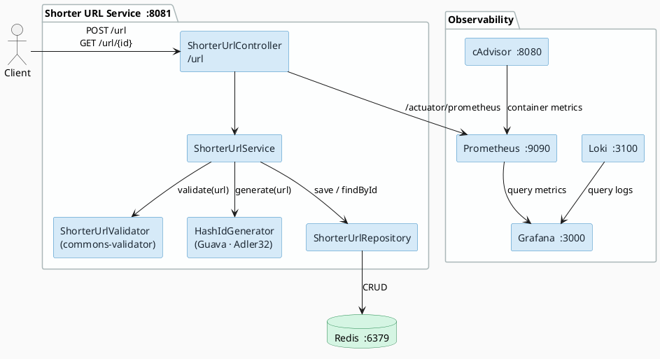

[](https://www.apache.org/licenses/LICENSE-2.0)

## Shorter URL Microservice

## 📋 Overview

The Shorter URL Service generates compact aliases for long URLs and redirects users from the short link back to the original destination. Shortened URLs are stored in Redis with a TTL of one year, and each ID is produced by an Adler-32 hash of the original URL using Guava.

---

## 🏗️ Architecture



---

## 📚 API Endpoints

### Shorten a URL
- **Endpoint:** `POST /url`
- **Description:** Accepts a long URL as plain text and returns a shortened URL.
- **Response:** `200 OK` with the shortened URL as plain text.

Request Example:
```
https://github.com/joeltadeu/shorterurl/blob/master/src/main/java/com/shorterurl/controller/ShorterUrlController.java
```

Response Example:
```
http://localhost:8081/url/tN72u2j
```

---

### Redirect to Original URL
- **Endpoint:** `GET /url/{id}`
- **Description:** Extracts the hash ID from the path, looks it up in Redis, and redirects the client to the original URL.
- **Response:** `302 Found` with a `Location` header pointing to the original URL.

Request Example:
```
GET http://localhost:8081/url/tN72u2j
```

---

## 📘 Documentation & Testing

### OpenAPI / Swagger
Once the service is running, you can access the interactive API documentation:

http://localhost:8081/swagger-ui.html

### Scalar UI
An alternative modern API UI is also available at:

http://localhost:8081/scalar-ui.html

---

## 🔨 Build Project & Running Locally

To build the project using Maven:

```bash
mvn clean package
```

### Running Locally

```bash
mvn spring-boot:run -Dspring-boot.run.profiles=dev
```

### Running as a Container

The service includes a **Dockerfile** to build a lightweight, secure container image using [Distroless](https://github.com/GoogleContainerTools/distroless).

```dockerfile
FROM gcr.io/distroless/java25-debian13

ADD target/shorter-url-service.jar app.jar

EXPOSE 8080

ENTRYPOINT ["java", "-jar", "/app.jar"]
```

### Running with Docker Compose

Start the full stack (application, Redis, Prometheus, Grafana, Loki, cAdvisor):

```bash
docker-compose up
```

```bash
docker-compose down
```

---

## 📊 Monitoring

| Tool       | URL                                        | Notes                                           |
|------------|--------------------------------------------|-------------------------------------------------|
| Prometheus | [http://localhost:9090](http://localhost:9090) | Scrapes `/actuator/prometheus`               |
| Grafana    | [http://localhost:3000](http://localhost:3000) | Login: `admin / admin`                       |
| Loki       | [http://localhost:3100](http://localhost:3100) | Centralised log aggregation                  |
| cAdvisor   | [http://localhost:8080](http://localhost:8080) | Container resource usage metrics             |

---

## 🛠️ Stack

- Java 25
- Spring Boot 4.0.6
- Spring Data Redis
- springdoc-openapi 3.0.1
- Micrometer / Prometheus
- Guava 33.6.0
- Apache Commons Validator 1.10.1

---

## 📄 License

This project is licensed under the Apache License 2.0 - see the [LICENSE](https://www.apache.org/licenses/LICENSE-2.0) file for details.

---
